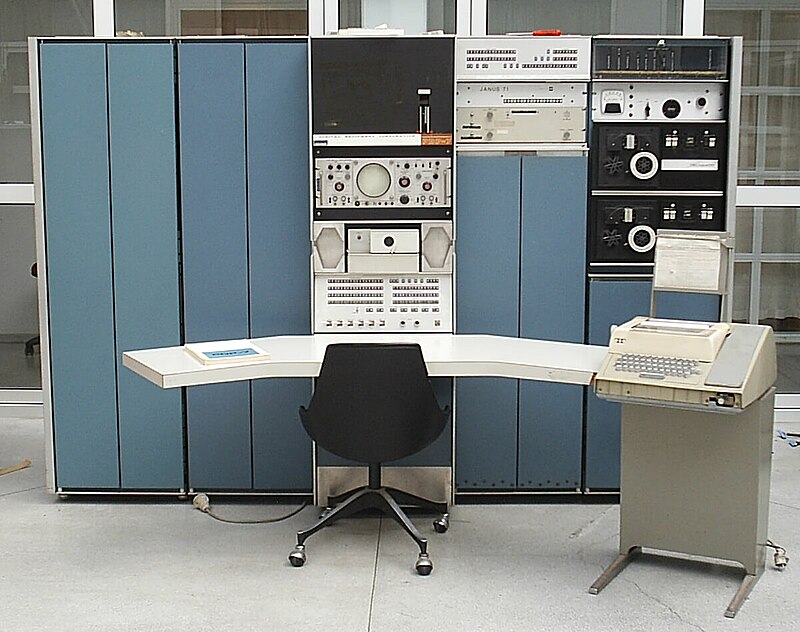

# chapter 1 introducing C

## 1.1 History of C

### Origins

>C is a by-product of the [UNIX operating system], which was developed at [Bell labs] by Ken Thompson, Dennis Ritchie, and others. Thompson single-handedly wrote the original version of UNIX, which ran on the [DEC-PDP-7] computer.

### Standardization

### C-Based Languages

## 1.2 Strengths and Weaknesses of C

### Strengths

- Efficiency
- Portability
- Power
- Flexibility
- Standard Library
- Integration with UNIX

> C is particularly powerful in combination with UNIX(including the popular variant known as Linux). In fact, some UNIX tools assume that the user knows C.

### Weaknesses

- error-prone
- difficult to understand
- difficult to modify
### Effective Use of C

- Learn how to avoid C pitfalls.
- Use software tools to make programs more reliable.
- Take advantage of existing code libraries.
- Adopt a sensible set of coding conventions.
- Avoid *"tricks"* and overly complex code.
- Stick to the standard.

[Bell labs]: https://en.wikipedia.org/wiki/Bell_Labs
[DEC-PDP-7]: https://en.wikipedia.org/wiki/PDP-7
[UNIX operating system]: https://en.wikipedia.org/wiki/Unix